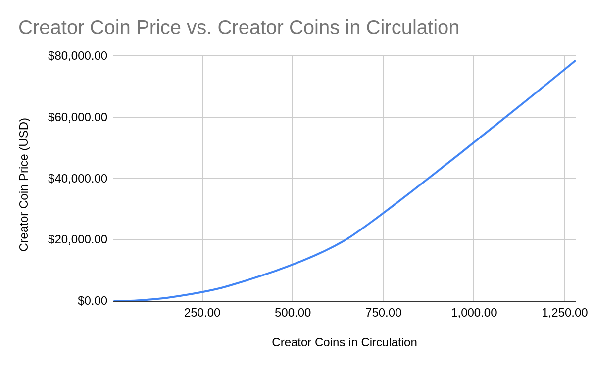

# 2⃣ 创作者币

## 区块链原生社交功能

在发布之初，DeSo 区块链就不仅支持创建个人资料和帖子等传统社交功能，还支持社交代币、打赏和 NFT 等创新的区块链原生功能。

这些功能本身就能开启许多全新的、与金钱相关的产品类别，从社交 NFT 体验到网红证券市场。

借助 DeSo 支持的应用程序，这些产品可以让创作者在与粉丝保持更直接关系，同时相比于传统社交网络，可以赚取更多的收入。

此外，与 DeSo 的商业模式相比，创作者不再被局限于几个中心化的应用，因为 DeSo 的商业模式是围绕着通过成千上万的第三方应用的去中心化网络进行交易，类似于今天以太坊为去中心化金融（DeFi）应用提供支持的方式。

我们相信，这种更去中心化的商业模式可以取代传统的、以广告为驱动的社交媒体商业模式，后者本质上需要将用户集中到少数高度中心化的应用中，以便实现利润最大化。

### 什么是社交代币？（又称创作者代币）

#### 每个人都有一个代币

在 DeSo 上，每个账号都对应一个任何人都可以买卖的代币。

我们称这些代币为“**创作者代币**”，只要创建个人资料，你也可以拥有自己的代币。当人们购买时，代币价格上涨；当人们出售时，价格下跌。

**你可以购买你最喜欢的人的代币**

要购买某人的代币，只需在任何 DeSo 应用（如 diamondapp.com）上找到他们的个人资料，然后点击“购买”。

你可以通过搜索找到某人的个人资料，或者查看创作者代币排行榜（如下）。

<figure><figcaption></figcaption></figure>

### 创作者代币有什么用？

创作者代币是一种新型资产类别，与公司或商品不同，它与个人的声誉挂钩。

它们是我们为交易“社交影响力”创造的第一个工具。在这样的社会中，如果人们了解这一点，那么一个人的代币价值就应该与这个人的知名度相关。

例如，如果埃隆·马斯克成功让第一个人登陆火星，他的代币价格理论上应该暴涨。

相反，如果他在新闻发布会上发表种族歧视言论，他的代币价格理论上应该下跌。

因此，相信某人潜力的人可以购买他们的代币，并在该人实现自身潜能时在财务上获得成功。交易者也可以通过买卖涨跌来赚钱。

除此之外，我们希望在不久的将来整合更多令人兴奋的创作者代币机会：

#### 利益相关者会议

创作者可以设置只有拥有一定数量他们代币的人才能参与他们帖子的评论区。

这迫使任何想在创作者内容中发言的人首先通过购买他们的代币与创作者成为利益共同体。

这种一致性不仅大大减少了垃圾信息，而且可能使现有平台上的对话更加积极。

这也会大大增加某人代币的需求——你能想象马斯克或V神进行AMA时，参与者需要购买一定数量的他们的代币作为门槛吗？或者，按照代币持有量的顺序回答问题？

#### 高级消息

大多数创作者在社交媒体消息收件箱里收到大量垃圾邮件。

使用DeSo，他们可以设置只有拥有一定数量他们代币的人才能给他们发消息，或者只关注和回应代币持有量较大的人发来的消息。

或者，他们可以要求必须支付一定数量的他们的代币才能让消息进入收件箱。

所有这些都将增加他们代币的需求，同时帮助创作者最大限度地减少垃圾邮件。

#### 赞助帖子

创作者可以设置一个“收件箱”，任何人都可以在其中“竞标”让他们转发（即“转推”）某个帖子。

如果你想让金·卡戴珊转发你的时尚品牌，你可以在她的收件箱里提交一个申请，如果她转发了，她就可以获得你的钱。

竞标可以全部使用创作者自己的代币进行，从而大大增加代币的需求。

#### 高级内容

拥有一定数量创作者代币的人可以获得特殊内容。或者另一种方式，人们必须以创作者代币的形式支付月费才能获得高级内容。

#### 分发和参与

创作者还可以使用他们的代币向代币持有量最大的粉丝分发稀缺资源。

例如，想象一下，如果一位著名的名人承诺与在特定日期持有他们大部分代币的人共进午餐。

或者，想象一下，如果他们前1000名持有者提供1000张签名海报。

这仅仅是创作者如何利用他们的代币与粉丝互动的开始，所有这些想法都可能大大增加创作者代币的需求。

#### 金钱点赞

点赞可以重新构思为购买创作者的代币。

所以点赞是要花钱的，但你在点赞时会获得那个人的代币（实际上是购买与他们内容直接关联的代币的快捷方式）。

这样的功能也可以更好地反映出哪些内容是高质量的。

#### 新兴现象

当你给人们炒作个人声誉的能力时会发生什么？

我们无法确切知道，但出现的一个特点是我们所说的“买入并转发”。

通常情况下，转发别人的内容对你来说没有任何收益。

如果那个人因为你的推动而成为超级明星，他们几年后甚至还记得你的名字就谢天谢地了。

相反，在DeSo上，你可以购买某人的代币，然后转发他们的内容，这使得你在他们迅速走红时不仅能在财务上共同分享，而且还能炫耀。

想象一下，说“我早期转发了她的内容”，跟另一种说法“我在她的代币价格还是5美元时购买了她的代币，现在已经涨到5000美元了——顺便说一下，我已经做了很多次了，而且我可以证明，因为我的购买记录都记在了区块链上”，两者相比高下立判。

关于这个机制有趣的是，它甚至不是有意设计到产品中的。它作为核心创作者代币机制的“新兴”现象而存在。

还有哪些我们尚未想到的可能性呢？

### 创作者代币供应曲线

创作者代币具有天然稀缺性，通常每个账号对应的代币数量在100到1,500之间。

这是因为随着越来越多的人购买该用户的创作者代币，代币价格会自动上涨，并且上涨速度越来越快。这意味着，最终，即使是铸造多一个代币也需要数十亿美元。

确定创作者代币价格的公式或“曲线”如下所示。请注意，创作者代币通常用DeSo加密货币购买和出售，但我们提供一个美元版本的公式以便于计算：

$$
以DeSo定价 = .003 \times 创作者代币流通量^2 \\ 以美元定价= .003 \times 创作者代币流通量^2 \times DeSo美元价格
$$

当你创建一个账号时，最初不存在代币，因此价格为零。

如果你想从个人资料中购买代币，它会根据上面的价格曲线在链上为你铸造并出售，随着购买的代币越来越多，价格越来越高。

你用来购买代币的钱会被“锁定”在个人账户中，以换取代币。反过来，如果你想卖出代币，个人账户会根据曲线用之前购买时锁定的钱从你那里购买。

因此，购买会**创造**代币，**推高**价格并将资金**锁定**在个人账户中，而出售会**销毁**代币，**拉低**价格并从个人账户中**解锁**资金。

这通常被称为“自动做市商”（AMM），跟Uniswap和Bancor等协议具有的相同概念。

下面是一个图表，显示了根据给定个人账户流通的创作者代币数量对应的创作者代币价格函数曲线。

我们还提供一个表格，显示了其中的一些值。这两者都假设DeSo的价格为16美元。

去注意，对价格曲线进行数学上的“积分运算”，会得出“锁定”在个人账户中的资金总额，这等于已流入该特定创作者代币的“净”资金数量（包括在表格的第三列中）。

如果你想自己计算一下，可以使用[这个表格](https://docs.google.com/spreadsheets/d/1ecMscQTY4rhmfrAn-5SRspiZqhhttVo1Pj880A4EDuo/edit?usp=sharing)（复制以编辑）。你还可以在[这里](https://yos.io/2018/11/10/bonding-curves)了解更多关于债券曲线的信息。

| **创作者代币流通量** | 创作者代币价格 **(USD)** | **USD锁仓量**  |
| ------------ | ----------------- | ----------- |
| 5            | $1.20             | $2          |
| 10           | $4.80             | $16         |
| 20           | $19.20            | $128        |
| 40           | $76.80            | $1,024      |
| 80           | $307.20           | $8,192      |
| 160          | $1,228.80         | $65,536     |
| 320          | $4,915.20         | $524,288    |
| 640          | $19,660.80        | $4,194,304  |
| 1280         | $78,643.20        | $33,554,432 |

<figure><figcaption></figcaption></figure>

### 创始人奖励

每个账户都允许创作者保留一定百分比的代币作为“创始人奖励”。

例如，如果有人将其创始人奖励百分比设置为10%，然后有人购买了100个DeSo的代币，那么10个DeSo将进入创作者的钱包，而不是购买者的钱包。

尽管如此，我们认为让创作者分享代币上涨的更好方法是在创建个人资料时立即购买他们的代币，然后将创始人奖励百分比设置为零。

这是有效的，因为代币在曲线开始时最便宜，而且它还有降低后续购买他们代币的滑点的优势。

尽管如此，创始人奖励百分比为10%是一个“合理的默认值”，即使创作者什么都不做，也能确保他们保持一定比例的代币。
